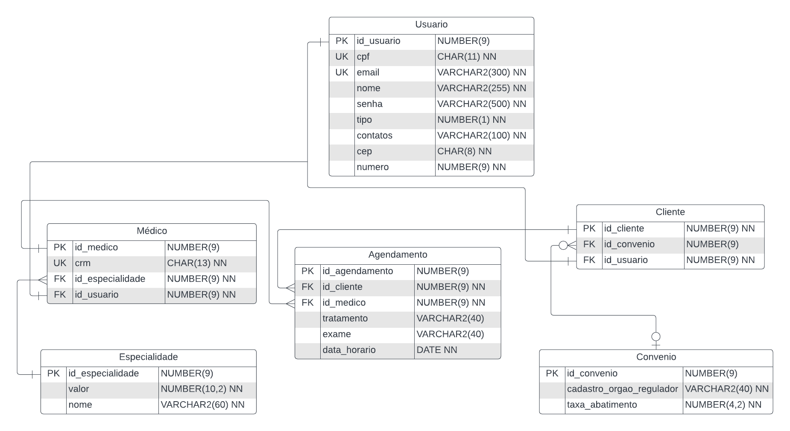

# Safety Soft
<h3> <i> 'Segurança dos dados e qualidade de vida' </i> </h3>
<h2 style="text-align: center" >Projeto Java para Agendamento e Gestão de Consultas Médicas</h2>

    Este projeto tem como ponto principal o desenvolvimento de uma API RESTful do sistema back-end para a gerência e agendamentos de consultas médicas.

    <strong> ⛺ Estrutura principal:</strong>
     Pode-se criar, editar, excluir, consultar e listar:
    <ul>
        <li>Usuário - <i>possui informações pessoais básicas e de login. Pode ser médico ou cliente.</i></li>
        <li>Cliente - <i>é vinculado a algum usuário de seu tipo, esse pode ter algum Convênio.</i></li>
        <li>Convênio - <i>para o cadastro no Cliente, podendo ter algum abatimento no valor da consulta.</i></li>
        <li>Médico - <i>também vinculado a algum usuário de seu tipo, possuem necessariamente alguma Especialidade.</i></li>
        <li>Especialidade - <i>para registrar a atuação e variante do valor de consulta dos médicos.</i></li>
        <li>Agendamento - <i>é usado para registrar uma consulta de um paciente (Cliente) com um médico.</i></li>
    </ul>
    O sistema conta também com o envio de e-mails informativos ao cadastrar um usuário (ao e-mail desse) e para ações de criação, edição e remoção de agendamento (enviado tanto ao médico, quanto ao cliente).

### 🛠 Tecnologias e padrões de projeto
<ul>
    <li>Java 17</li>
    <li>JDBC 8</li>
    <li>Spring Boot</li>
    <li>Banco de dados Oracle</li>
    <li>JavaMail com templates FreeMarker</li>
    <li>Swagger</li>
    <li>Jenkins</li>
    <li>Abordagem MVC</li>
    <li>Padrão de projeto DTO</li>
</ul>
<h6><i> Obs.: deploy disponvível somente internamente</i></h6>

### Diagrama de Entidade e Relacionamento (Banco de Dados)

### Diagrama de classes (Estrutura do código)

<a href="docs/Diagrama_de_Classes.png">Clique aqui para visualizar.</a>

#### Vem Ser - Trabalho final do Módulo 3
## Trello da divisão de tarefas:

https://trello.com/b/cbQhdkhN/kanban-m%C3%B3dulo-3-trabalho-final

<h2>Autores</h2> 
<table>
  <tr>
    <td align="center"><a href="https://github.com/matheus1629"> <b>Matheus Palermo</b></a> </td>
    <td align="center"><a href="https://github.com/pedro-s-20"> <b>Pedro Sousa</b></a> </td>
    <td align="center"><a href="https://github.com/Gabriel-Gomes-Meira"> <b>Gabriel Meira</b></a> </td>
  </tr>
</table>

Este projeto foi baseado no seguinte repositório: https://github.com/pedro-s-20/vemser-trabalho-final-BD

